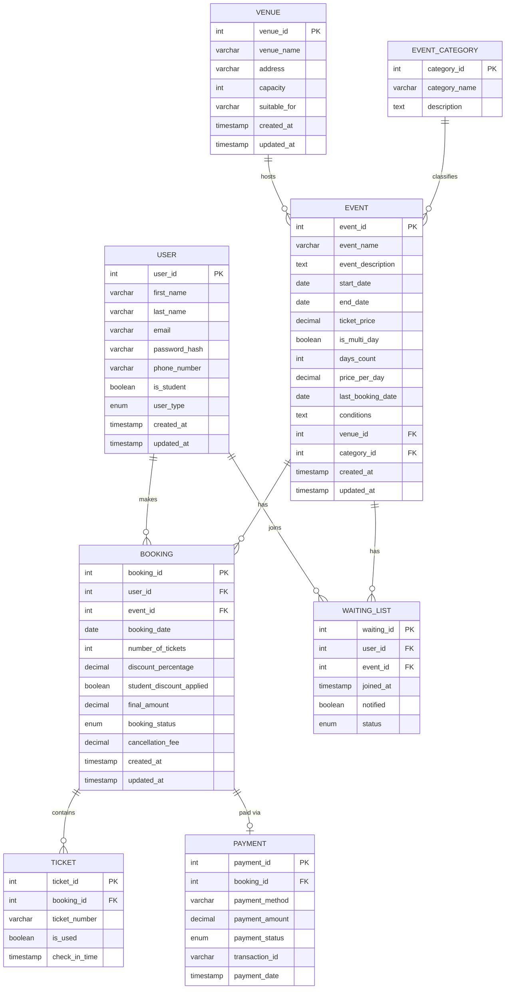

# BRISTOL EVENTS MANAGEMENT SYSTEM - DATABASE DESIGN
## Student ID: [25054539]
## Date: January 2026

---

## 1. ENTITY RELATIONSHIP DIAGRAM (ERD)

### 1.1 ERD Diagram (Mermaid — renders in VS Code, GitHub, mermaid.live)



---

### 1.2 Entities and Attributes

1. **USER**
   - user_id (PK)
   - first_name
   - last_name
   - email
   - password_hash
   - phone_number
   - is_student
   - user_type (standard/admin)
   - created_at
   - updated_at

2. **VENUE**
   - venue_id (PK)
   - venue_name
   - address
   - capacity
   - suitable_for (event types)
   - created_at
   - updated_at

3. **EVENT_CATEGORY**
   - category_id (PK)
   - category_name (Exhibition, Workshop, Sports, Musical, Theatre, Religious, Community)
   - description

4. **EVENT**
   - event_id (PK)
   - event_name
   - event_description
   - start_date
   - end_date
   - ticket_price
   - is_multi_day
   - days_count
   - price_per_day
   - last_booking_date
   - conditions (e.g., formal dress)
   - venue_id (FK → VENUE)
   - category_id (FK → EVENT_CATEGORY)
   - created_at
   - updated_at

5. **BOOKING**
   - booking_id (PK)
   - user_id (FK → USER)
   - event_id (FK → EVENT)
   - booking_date
   - number_of_tickets
   - discount_percentage
   - student_discount_applied
   - final_amount
   - booking_status (confirmed/cancelled/pending)
   - cancellation_fee
   - created_at
   - updated_at

6. **TICKET**
   - ticket_id (PK)
   - booking_id (FK → BOOKING)
   - ticket_number
   - is_used
   - check_in_time

7. **WAITING_LIST**
   - waiting_id (PK)
   - user_id (FK → USER)
   - event_id (FK → EVENT)
   - joined_at
   - notified
   - status (waiting/offered/expired)

8. **PAYMENT**
   - payment_id (PK)
   - booking_id (FK → BOOKING)
   - payment_method
   - payment_amount
   - payment_status
   - transaction_id
   - payment_date

---

## 2. RELATIONSHIPS

| # | Entities | Multiplicity | Description |
|---|----------|-------------|-------------|
| 1 | USER → BOOKING | One-to-Many (1..*) | One user can make many bookings; each booking belongs to one user |
| 2 | EVENT → BOOKING | One-to-Many (1..*) | One event can have many bookings; each booking is for one event |
| 3 | VENUE → EVENT | One-to-Many (1..*) | One venue can host many events; each event is at one venue |
| 4 | EVENT_CATEGORY → EVENT | One-to-Many (1..*) | One category can contain many events; each event has one category |
| 5 | BOOKING → TICKET | One-to-Many (1..*) | One booking generates many tickets (one per person); each ticket belongs to one booking |
| 6 | USER → WAITING_LIST | One-to-Many (0..*) | One user can be on waiting lists for many events; each entry belongs to one user |
| 7 | EVENT → WAITING_LIST | One-to-Many (0..*) | One event can have many users on its waiting list; each entry is for one event |
| 8 | BOOKING → PAYMENT | One-to-One (0..1) | Each booking has at most one payment record; each payment is for one booking |

---

## 3. NORMALIZATION PROCESS

### 3.1 FIRST NORMAL FORM (1NF)

**Requirements for 1NF:**
- Eliminate repeating groups
- Each cell contains a single atomic value
- Each record is unique (has a primary key)

---

**Example 1 — EVENT table (multi-valued columns)**

**Before 1NF (Unnormalized):**
```
EVENT_TABLE:
| event_id | event_name     | venues       | categories              | dates                      |
|----------|----------------|--------------|-------------------------|----------------------------|
| 1        | Balloon Fiesta | Ashton Court | Festival, Musical        | 15-Feb, 16-Feb, 17-Feb     |
```

**Problem:** Multiple values in `venues`, `categories`, and `dates` columns — violates atomicity.

**After 1NF:**
```
EVENT:
| event_id | event_name     | venue_id | category_id | start_date | end_date |
|----------|----------------|----------|-------------|------------|----------|
| 1        | Balloon Fiesta | 1        | 1           | 15-Feb     | 22-Feb   |
```

**Changes Made:**
1. Split multi-valued attributes into separate atomic columns
2. Created separate VENUE and EVENT_CATEGORY tables with their own PKs
3. Each field now contains only one value
4. Date range replaced with `start_date` and `end_date` (two atomic columns)

---

**Example 2 — USER table (non-atomic contact field)**

**Before 1NF (Unnormalized):**
```
USER_TABLE:
| user_id | full_name      | contacts                                      |
|---------|----------------|-----------------------------------------------|
| 101     | John Smith     | 07700900001, 07700900002, john@email.com      |
| 102     | Sarah Jones    | 07811223344, sarah@email.com                  |
```

**Problem:** `full_name` contains two values (first + last name), and `contacts` stores multiple phone numbers and an email address in one cell — not atomic.

**After 1NF:**
```
USER:
| user_id | first_name | last_name | email           | phone_number |
|---------|-----------|-----------|-----------------|--------------|
| 101     | John       | Smith     | john@email.com  | 07700900001  |
| 102     | Sarah      | Jones     | sarah@email.com | 07811223344  |
```

**Changes Made:**
1. Split `full_name` into `first_name` and `last_name` (atomic values)
2. Separated `email` and `phone_number` into their own dedicated columns
3. Each cell now holds exactly one value

---

### 3.2 SECOND NORMAL FORM (2NF)

**Requirements for 2NF:**
- Must be in 1NF
- All non-key attributes must be fully dependent on the **entire** primary key
- No partial dependencies (relevant when a composite PK exists)

---

**Example 1 — BOOKING table (partial dependencies on user and event)**

**Before 2NF (Has Partial Dependency):**
```
BOOKING_TABLE:
| booking_id | user_id | event_id | user_email      | event_name     | booking_date | amount |
|------------|---------|----------|-----------------|----------------|--------------|--------|
| 1          | 101     | 1        | user@email.com  | Balloon Fiesta | 01-Jan       | 70.00  |
```

**Problem:**
- `user_email` depends only on `user_id` — not the full booking
- `event_name` depends only on `event_id` — not the full booking
- These are partial dependencies

**After 2NF:**

**USER Table:**
```
| user_id | first_name | last_name | email           | phone_number |
|---------|-----------|-----------|-----------------|--------------|
| 101     | John       | Smith     | user@email.com  | +44123456    |
```

**EVENT Table:**
```
| event_id | event_name     | venue_id | category_id | ticket_price |
|----------|----------------|----------|-------------|--------------|
| 1        | Balloon Fiesta | 1        | 1           | 70.00        |
```

**BOOKING Table:**
```
| booking_id | user_id | event_id | booking_date | final_amount |
|------------|---------|----------|--------------|--------------|
| 1          | 101     | 1        | 01-Jan       | 70.00        |
```

**Changes Made:**
1. Removed `user_email` from BOOKING — it now lives in USER
2. Removed `event_name` from BOOKING — it now lives in EVENT
3. All non-key attributes in BOOKING now depend fully on `booking_id`

---

**Example 2 — TICKET table (event details stored redundantly)**

**Before 2NF (Redundant Event Data):**
```
TICKET_TABLE:
| ticket_id | booking_id | event_name     | event_date | ticket_number   | is_used |
|-----------|------------|----------------|------------|-----------------|---------|
| 1         | 1          | Balloon Fiesta | 15-Feb     | BCE-2026-1-1    | FALSE   |
| 2         | 1          | Balloon Fiesta | 15-Feb     | BCE-2026-1-2    | FALSE   |
```

**Problem:**
- `event_name` and `event_date` are not properties of a ticket — they belong to EVENT
- They are reachable via `booking_id → event_id`, making them a partial/transitive dependency
- Duplicated on every row for the same booking

**After 2NF:**
```
TICKET:
| ticket_id | booking_id | ticket_number | is_used | check_in_time |
|-----------|------------|---------------|---------|---------------|
| 1         | 1          | BCE-2026-1-1  | FALSE   | NULL          |
| 2         | 1          | BCE-2026-1-2  | FALSE   | NULL          |
```

**Changes Made:**
1. Removed `event_name` and `event_date` from TICKET — retrieved via JOIN (TICKET → BOOKING → EVENT)
2. TICKET now only contains attributes that describe the ticket itself
3. No redundancy — event data is stored once in EVENT

---

### 3.3 THIRD NORMAL FORM (3NF)

**Requirements for 3NF:**
- Must be in 2NF
- No transitive dependencies
- Non-key attributes must not depend on other non-key attributes

---

**Example 1 — EVENT table (venue attributes stored inside event)**

**Before 3NF (Has Transitive Dependency):**
```
EVENT_TABLE:
| event_id | event_name     | venue_id | venue_name  | venue_address     | venue_capacity |
|----------|----------------|----------|-------------|-------------------|----------------|
| 1        | Balloon Fiesta | 1        | Ashton Gate | Bristol Road, BS1 | 150            |
```

**Problem:**
- `venue_name`, `venue_address`, and `venue_capacity` all depend on `venue_id`, not `event_id`
- This is a transitive dependency: `event_id → venue_id → venue_attributes`

**After 3NF:**

**EVENT Table:**
```
| event_id | event_name     | start_date | end_date | ticket_price | venue_id | category_id |
|----------|----------------|------------|----------|--------------|----------|-------------|
| 1        | Balloon Fiesta | 15-Feb     | 22-Feb   | 70.00        | 1        | 1           |
```

**VENUE Table:**
```
| venue_id | venue_name  | address           | capacity | suitable_for    |
|----------|-------------|-------------------|----------|-----------------|
| 1        | Ashton Gate | Bristol Road, BS1 | 150      | Musical, Sports |
```

**Changes Made:**
1. Created a separate VENUE table
2. Removed all venue attributes from EVENT — only `venue_id` (FK) remains
3. Eliminated transitive dependency: event_id now only determines event-specific data

---

**Example 2 — BOOKING table (calculated/derived fields)**

**Before 3NF (Derived Fields Stored):**
```
BOOKING_TABLE:
| booking_id | user_id | event_id | ticket_price | num_tickets | discount_pct | total  | discount_amt | final_amt |
|------------|---------|----------|--------------|-------------|--------------|--------|--------------|-----------|
| 1          | 101     | 1        | 70.00        | 2           | 15           | 140.00 | 21.00        | 119.00    |
```

**Problem:**
- `total = ticket_price × num_tickets` (derived — depends on other non-key attributes)
- `discount_amount = total × discount_pct / 100` (derived)
- `final_amount = total − discount_amount` (derived)
- These are transitive dependencies between non-key attributes

**After 3NF:**
```
BOOKING:
| booking_id | user_id | event_id | booking_date | number_of_tickets | discount_percentage | final_amount |
|------------|---------|----------|--------------|-------------------|---------------------|--------------|
| 1          | 101     | 1        | 01-Jan       | 2                 | 15                  | 119.00       |
```

**Changes Made:**
1. Removed `ticket_price` from BOOKING — retrieved from EVENT via JOIN
2. Removed `total_amount` and `discount_amount` — calculated at query time when needed:
   - `total = ticket_price (from EVENT) × number_of_tickets`
   - `discount = total × discount_percentage / 100`
   - `final = total − discount`
3. Only `final_amount` is stored (the confirmed price at time of booking, which must be preserved)

---

## 4. ERD-TO-SQL MAPPING
--"This mapping table confirms that all 8 ERD entities are implemented in SQL, with all primary keys, foreign keys, and constraints accounted for.
The table below confirms that every entity in the ERD has been implemented as a `CREATE TABLE` statement in `bristol_events.sql`, with all attributes and relationships present.

| ERD Entity | SQL Table | Primary Key | Foreign Keys | Notes |
|---|---|---|---|---|
| USER | `USER` | `user_id` | — | `user_type` ENUM('standard','admin'); `is_student` BOOLEAN |
| VENUE | `VENUE` | `venue_id` | — | `capacity` CHECK > 0 |
| EVENT_CATEGORY | `EVENT_CATEGORY` | `category_id` | — | 7 seed categories inserted |
| EVENT | `EVENT` | `event_id` | `venue_id → VENUE`, `category_id → EVENT_CATEGORY` | `start_date < end_date` CHECK constraint |
| BOOKING | `BOOKING` | `booking_id` | `user_id → USER`, `event_id → EVENT` | `booking_status` ENUM; `cancellation_fee` DEFAULT 0 |
| TICKET | `TICKET` | `ticket_id` | `booking_id → BOOKING` | `ticket_number` UNIQUE; `is_used` BOOLEAN |
| WAITING_LIST | `WAITING_LIST` | `waiting_id` | `user_id → USER`, `event_id → EVENT` | `status` ENUM('waiting','offered','expired') |
| PAYMENT | `PAYMENT` | `payment_id` | `booking_id → BOOKING` | `payment_status` ENUM('pending','completed','failed') |

All 8 entities are implemented. All foreign key relationships use `ON DELETE CASCADE` or `ON DELETE RESTRICT` constraints to enforce referential integrity. The database structure is fully mapped to the ERD.

---

## 5. FINAL DATABASE SCHEMA IN 3NF

### Table: USER
- user_id INT PRIMARY KEY AUTO_INCREMENT
- first_name VARCHAR(50)
- last_name VARCHAR(50)
- email VARCHAR(100) UNIQUE
- password_hash VARCHAR(255)
- phone_number VARCHAR(20)
- is_student BOOLEAN DEFAULT FALSE
- user_type ENUM('standard', 'admin') DEFAULT 'standard'
- created_at TIMESTAMP DEFAULT CURRENT_TIMESTAMP
- updated_at TIMESTAMP DEFAULT CURRENT_TIMESTAMP ON UPDATE CURRENT_TIMESTAMP

### Table: VENUE
- venue_id INT PRIMARY KEY AUTO_INCREMENT
- venue_name VARCHAR(100)
- address VARCHAR(255)
- capacity INT CHECK (capacity > 0)
- suitable_for VARCHAR(255)
- created_at TIMESTAMP DEFAULT CURRENT_TIMESTAMP
- updated_at TIMESTAMP DEFAULT CURRENT_TIMESTAMP ON UPDATE CURRENT_TIMESTAMP

### Table: EVENT_CATEGORY
- category_id INT PRIMARY KEY AUTO_INCREMENT
- category_name VARCHAR(50)
- description TEXT

### Table: EVENT
- event_id INT PRIMARY KEY AUTO_INCREMENT
- event_name VARCHAR(150)
- event_description TEXT
- start_date DATE
- end_date DATE
- ticket_price DECIMAL(10, 2)
- is_multi_day BOOLEAN DEFAULT FALSE
- days_count INT DEFAULT 1
- price_per_day DECIMAL(10, 2)
- last_booking_date DATE
- conditions TEXT
- venue_id INT FK → VENUE
- category_id INT FK → EVENT_CATEGORY
- created_at TIMESTAMP DEFAULT CURRENT_TIMESTAMP
- updated_at TIMESTAMP DEFAULT CURRENT_TIMESTAMP ON UPDATE CURRENT_TIMESTAMP

### Table: BOOKING
- booking_id INT PRIMARY KEY AUTO_INCREMENT
- user_id INT FK → USER
- event_id INT FK → EVENT
- booking_date DATE
- number_of_tickets INT
- discount_percentage DECIMAL(5, 2) DEFAULT 0
- student_discount_applied BOOLEAN DEFAULT FALSE
- final_amount DECIMAL(10, 2)
- booking_status ENUM('confirmed', 'cancelled', 'pending') DEFAULT 'pending'
- cancellation_fee DECIMAL(10, 2) DEFAULT 0
- created_at TIMESTAMP DEFAULT CURRENT_TIMESTAMP
- updated_at TIMESTAMP DEFAULT CURRENT_TIMESTAMP ON UPDATE CURRENT_TIMESTAMP

### Table: TICKET
- ticket_id INT PRIMARY KEY AUTO_INCREMENT
- booking_id INT FK → BOOKING
- ticket_number VARCHAR(50) UNIQUE
- is_used BOOLEAN DEFAULT FALSE
- check_in_time TIMESTAMP NULL

### Table: WAITING_LIST
- waiting_id INT PRIMARY KEY AUTO_INCREMENT
- user_id INT FK → USER
- event_id INT FK → EVENT
- joined_at TIMESTAMP DEFAULT CURRENT_TIMESTAMP
- notified BOOLEAN DEFAULT FALSE
- status ENUM('waiting', 'offered', 'expired') DEFAULT 'waiting'

### Table: PAYMENT
- payment_id INT PRIMARY KEY AUTO_INCREMENT
- booking_id INT FK → BOOKING
- payment_method VARCHAR(50)
- payment_amount DECIMAL(10, 2)
- payment_status ENUM('pending', 'completed', 'failed') DEFAULT 'pending'
- transaction_id VARCHAR(100)
- payment_date TIMESTAMP DEFAULT CURRENT_TIMESTAMP

---

## 6. SUMMARY OF NORMALIZATION

The Bristol Events database is in **3rd Normal Form (3NF)** because:

1. **1NF Compliance:**
   - All attributes contain only atomic values (no multi-valued fields like comma-separated lists)
   - No repeating groups — each entity type has its own table
   - Every record has a unique identifier (primary key)

2. **2NF Compliance:**
   - Database is in 1NF
   - All non-key attributes are fully functionally dependent on the primary key
   - No partial dependencies exist (all tables have single-column PKs, and every column describes that entity only)

3. **3NF Compliance:**
   - Database is in 2NF
   - No transitive dependencies — non-key attributes depend only on the primary key, not on each other
   - Derived/calculated values (total, discount_amount) are not stored and are computed at query time

This design eliminates redundancy, ensures data integrity, and provides efficient storage and retrieval for the Bristol Events Management System.
